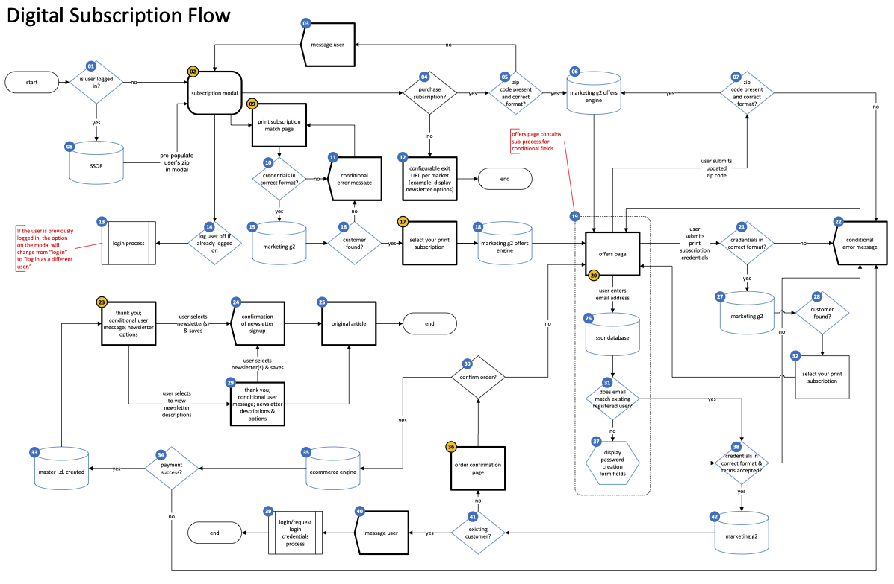

# 👋 Hello!

Hi, I’m Trent Sherrell – a UX Architect and Product Designer specializing in clarity.\
I help teams untangle complexity and build humane, scalable systems – often involving AI, information architecture, or both.

My work blends deep systems thinking with hands-on delivery. Whether I’m mapping flows, writing UX specs, or designing with generative tools, I focus on one thing: making hard things easier to understand and use.

This is my temporary portfolio.

**Curious how I might help with your project?** [Let’s talk.](./#contact-information)

## Work examples

### AI-powered business document & workflow automation

In this project, I led the UX and product design for an AI-driven system that streamlines business asset creation and workflow automation. The first proof of concept focused on employee handbook generation, where I designed an intuitive process that allows users to create documentation in minutes instead of months.

I collaborated with engineers to integrate AI capabilities trained on HR policies, industry regulations, and company-specific guidelines. Beyond static document creation, I designed a workflow where AI identifies actionable procedures and converts them into interactive, no-code workflows for seamless implementation. This approach improves efficiency, compliance, and accuracy, transforming how businesses manage essential documentation and processes.

<figure><figcaption>
Full document
</figcaption></figure>

<figure><figcaption>
Closeup of first flow diagram
</figcaption></figure>

### Adaptive widget system for customisable dashboards

I designed a dynamic widget system for a homepage dashboard that gives users control over the complexity and depth of displayed information. My approach allows widgets to expand or collapse vertically based on user preferences, ensuring both high-level overviews and in-depth insights within the same interface. To enhance usability, I structured the layout to adapt responsively across different screen sizes while maintaining content visibility.

<figure><figcaption>
Full document
</figcaption></figure>

<figure><figcaption>
Closeup of widget adjustment functionality
</figcaption></figure>

<figure><figcaption>
Closeup of wireframe
</figcaption></figure>

### Unified paywall design for diverse subscription models

I led the UX design initiative to develop a flexible paywall system capable of supporting distinct subscription strategies for both the Chicago Tribune and the LA Times. By creating customisable options within a single structure, we enabled each publication to tailor their digital subscription offerings to their unique audiences. This approach streamlined the user experience and facilitated efficient management of subscription models across multiple news outlets.

<figure><figcaption>
Full document
</figcaption></figure>

<figure><figcaption>
Closeup of flow diagram
</figcaption></figure>

### Comprehensive use case auditing for payment integration

As UX Architect, I conducted an in-depth use case audit to facilitate the integration of a third-party payment processor. Recognising the diverse needs of stakeholders – including engineers, managers, UX designers, legal teams, and leadership – I developed multiple visualisation artefacts. These detailed screen flows mapped interactions across various financial systems, illustrating the function of each interface element for different operations and user roles. This approach ensured clear communication of complex processes, enabling informed decision-making and seamless integration planning.

<figure><figcaption>
Full document
</figcaption></figure>

<figure><figcaption>
Closup of flow diagram
</figcaption></figure>

## Case Studies

### Case Study: Automating Support with AI – A Hard Lesson

#### Overview

In 2023, I contributed to a generative AI initiative at a large ecommerce company, where the goal was to streamline internal employee support through automation. The outcome, while technically effective, had human consequences I still reflect on.

#### My Role

* Prompt engineering for internal support queries
* QA testing of AI-generated responses
* Flagging edge cases and improving fallback logic

#### The Context

The system replaced the first tier of human support staff. Though the framing emphasised freeing up workers for higher-value tasks, I later questioned whether that redirection ever occurred – or whether those jobs were quietly eliminated.

#### What I Learned

This experience marked a turning point in how I think about ethical UX and AI.\
It reminded me that:

* Efficiency has consequences beyond the interface
* Designers are often downstream from decisions – but not without responsibility
* It’s okay to feel uncomfortable – and to speak about it

#### Why I’m Sharing This

I don’t showcase this project as a proud achievement, but as a _real-world example_ of how AI can reshape work – and how designers must grapple with the implications. It’s a story I continue to unpack as I grow.

### Case Study: Rapid CMS Ramp-Up – Building a Drupal Sandbox for Public Sector UX

#### Overview

When applying for a Website Lead role at the Washington State Department of Revenue, I identified Drupal CMS as a core requirement. Though I had broad CMS and UX experience, I lacked hands-on Drupal work – so I built a local sandbox environment to up-skill fast and honestly.

#### Approach

* Installed and configured a working instance of Drupal in a local development environment
* Familiarised myself with core concepts: content types, taxonomy, permissions, and theming
* Mapped example content and workflows to public-sector use cases (e.g. tasks, services, form submissions)
* Connected learnings to WCAG, plain language, and government accessibility standards

#### Outcome

This project helped me speak credibly and confidently about Drupal in my application, cover letter, and interview preparation. It also reinforced my broader strengths in CMS thinking, public accessibility, and rapid onboarding – skills highly transferable to public-sector UX leadership.

#### Reflection

While this wasn’t a shipped product, it represents one of my most important qualities: the willingness to build what doesn’t exist yet, to learn what’s needed, and to map that learning back to user needs and business goals.

<strong>🧠 Designed with AI Collaboration</strong>

This self-initiated project was shaped with support from a specialised AI agent I developed to accelerate my learning in CMS systems and AI-driven design workflows. I regularly create focused agents to extend my capabilities – whether it's analysing healthcare options, assisting with technical writing, or speeding up UX prototyping. For this Drupal sandbox, I partnered with an AI assistant trained on public-sector UX patterns and Drupal documentation to help structure the learning path, validate key concepts, and simulate collaborative critique. It’s a method I increasingly use to learn faster, design more ethically, and document more clearly.

## Contact information

Interested in working together? Fill out the form below. 👇


