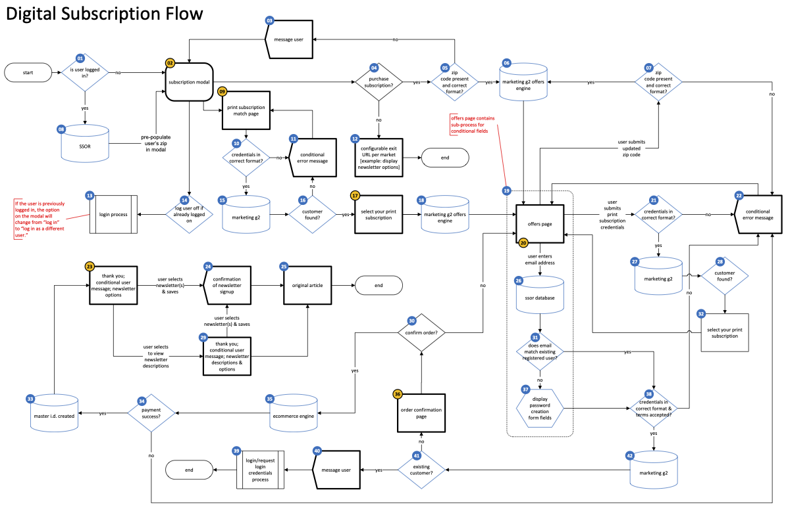

# 👋 Hello!

Hi, I'm Trent Sherrell—a Product Manager specializing in workflow systems, payments, and AI-driven platforms. I help teams bring order to complex operational environments where software meets real-world process. My work spans product strategy, UX systems thinking, and hands-on AI integration across fintech, media, compliance, and e-commerce.

**Curious how I might help with your project?** [Let’s talk.](./#contact-information)

***

## ✏️ Work examples

### AI-powered business document & workflow automation (EPHY)

I led product strategy and UX design for an AI-driven system that automates business document creation and workflow management for HR compliance teams. The first proof of concept focused on employee handbook generation — reducing a process that previously took months to minutes. I defined requirements, collaborated with engineers to integrate AI trained on HR policies and multi-state employment regulations, and designed the workflow logic that converts compliance procedures into interactive, no-code processes. The outcome improves accuracy, reduces legal exposure, and transforms how PEO clients manage essential documentation at scale.

<figure><figcaption>
Full document
</figcaption></figure>

<figure><figcaption>
Closeup of first flow diagram
</figcaption></figure>

### Adaptive widget system for customisable dashboards

I led product and UX design for a dynamic dashboard widget system that gives users control over the depth of information they see at a glance. I defined the requirements for expand/collapse behavior, worked with engineering on responsive layout logic, and validated the approach against real user workflows. The result is an interface that serves both the high-level overview user and the detail-oriented operator — without requiring separate views or manual configuration.

<figure><figcaption>
Full document
</figcaption></figure>

<figure><figcaption>
Closeup of widget adjustment functionality
</figcaption></figure>

<figure><figcaption>
Closeup of wireframe
</figcaption></figure>

### Unified paywall design for diverse subscription models (Tribune)

I led the product and UX initiative to design a flexible subscription paywall system supporting distinct strategies for the Chicago Tribune and the LA Times simultaneously. The challenge was building a single, manageable architecture that could be tailored to two different audiences and business models without duplicating infrastructure. I defined requirements, mapped user flows, and worked cross-functionally to deliver a system that streamlined subscription management across both publications — an early, high-stakes implementation of subscription-gated content at scale.

<figure><figcaption>
Full document
</figcaption></figure>

<figure><figcaption>
Closeup of flow diagram
</figcaption></figure>

### Comprehensive use case auditing for payment integration (OneMain)

As product lead on this integration effort, I conducted an end-to-end use case audit to support the transition from a legacy payment system to a modern third-party processor — including digital wallet payment methods such as Apple Pay, Samsung Pay, and PayPal. Recognising that engineers, legal, operations, and leadership each needed different views of the same complex system, I developed multiple artefact types: detailed screen flows, interaction maps, and role-specific documentation. This work ensured clear communication across stakeholders and gave the engineering team the requirements clarity needed to execute a clean integration.

<figure><figcaption>
Full document
</figcaption></figure>

<figure><figcaption>
Closup of flow diagram
</figcaption></figure>

***

***

## 💬 Contact information

Interested in working together? Fill out the form below. 👇


